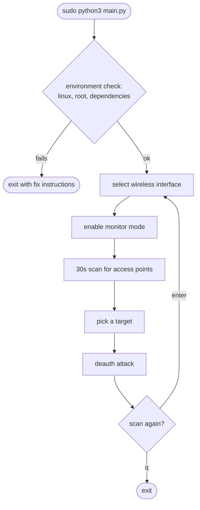
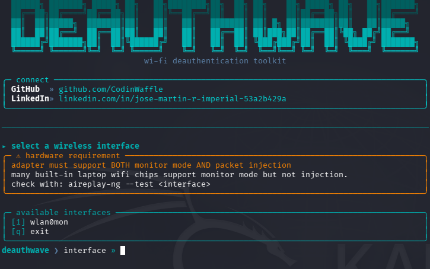
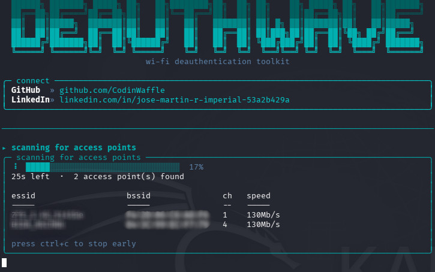
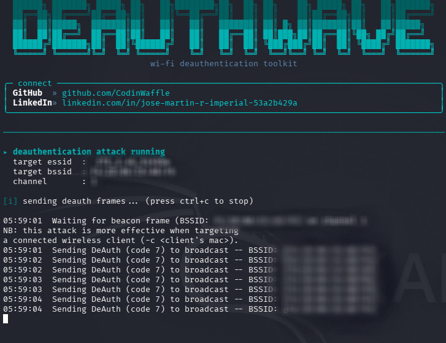

# DeauthWave

<div align="center">

```
      ██████╗ ███████╗ █████╗ ██╗   ██╗████████╗██╗  ██╗ ██╗    ██╗ █████╗ ██╗   ██╗███████╗
      ██╔══██╗██╔════╝██╔══██╗██║   ██║╚══██╔══╝██║  ██║ ██║    ██║██╔══██╗██║   ██║██╔════╝
      ██║  ██║█████╗  ███████║██║   ██║   ██║   ███████║ ██║ █╗ ██║███████║██║   ██║█████╗  
      ██║  ██║██╔══╝  ██╔══██║██║   ██║   ██║   ██╔══██║ ██║███╗██║██╔══██║╚██╗ ██╔╝██╔══╝  
      ██████╔╝███████╗██║  ██║╚██████╔╝   ██║   ██║  ██║ ╚███╔███╔╝██║  ██║ ╚████╔╝ ███████╗
      ╚═════╝ ╚══════╝╚═╝  ╚═╝ ╚═════╝    ╚═╝   ╚═╝  ╚═╝  ╚══╝╚══╝ ╚═╝  ╚═╝  ╚═══╝  ╚══════╝
```

*wi-fi deauthentication toolkit*

[](LICENSE)
[](https://www.python.org/)
[](#where-this-is-at)

</div>

A terminal Wi-Fi (802.11) deauthentication toolkit for Linux, built for authorized security testing.

## What it does

 **WiFi Deauth** puts an adapter into monitor mode, scans for nearby access points for 30 seconds, then sends 802.11 deauth frames at whichever one you pick, via `aireplay-ng`.



## Screenshots

**Select a wireless interface**



**Scan for nearby access points**



**Send the deauth attack**



## Before you use this

Only point DeauthWave at networks you own, or have explicit written permission to test — a pentest scope or your own lab. Deauthing someone else's WiFi without permission is illegal in most places and you're on your own if you do it.

## Where this is at

Built and tested on an actual Kali box, running against real hardware rather than just reading the code and hoping — a WiFi adapter with monitor mode and injection support. If you run into something unexpected, let me know — module, step, what you expected vs. what happened, a screenshot if you can grab one.

**This only targets Kali Linux and Parrot OS.** Both are built specifically for pentesting — they ship `aircrack-ng` out of the box, come with wireless drivers patched for monitor mode and injection, and are what the script is actually written and tested against (the exact `airmon-ng`/`airodump-ng`/`aireplay-ng` behavior it expects, plus an `apt`-based dependency installer). Other distros aren't a supported target — driver behavior, injection support, and even package availability can differ enough that things just won't work the same way.

| Platform | Status |
|---|---|
| Kali Linux | supported, actively tested |
| Parrot OS | supported, same Debian base, tooling, and command behavior as Kali, not actually tried yet |
| Everything else | not supported |

## Requirements

- Kali Linux or Parrot OS, run as root — see [Where this is at](#where-this-is-at) for why
- Python 3
- A wireless adapter that supports **both** monitor mode and packet injection. A lot of built-in laptop chips do the first and not the second — check with `aireplay-ng --test <interface>` before you count on one. An external USB adapter with a known-compatible chipset (Atheros, Ralink) is the safer bet.
- [`aircrack-ng`](https://www.aircrack-ng.org/) (`airmon-ng`, `airodump-ng`, `aireplay-ng`) — DeauthWave checks for it on startup and offers to install it via `apt` if missing.

## Running it

```bash
git clone https://github.com/CodinWaffle/DeauthWave.git
cd DeauthWave
sudo python3 main.py
```

## Author

Jose Martin Imperial
[LinkedIn](https://www.linkedin.com/in/jose-martin-r-imperial-53a2b429a/)
