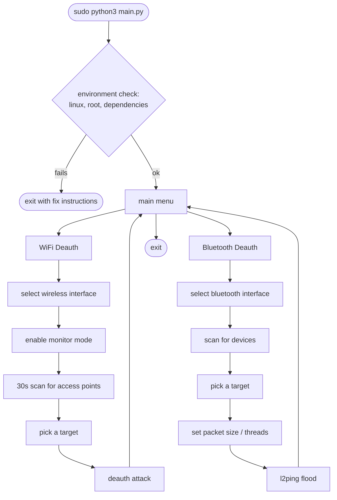

# AirFlood

A terminal WiFi and Bluetooth deauthentication toolkit for Linux, built for authorized security testing.


## What it does

Two modules, one menu:

- **WiFi Deauth** — puts an adapter into monitor mode, scans for nearby access points for 30 seconds, then sends deauth frames at whichever one you pick, via `aireplay-ng`.
- **Bluetooth Deauth** — scans for nearby Bluetooth devices and floods a chosen target with `l2ping`.



## Before you use this

Only point AirFlood at networks and devices you own, or have explicit written permission to test — a pentest scope, a CTF, your own lab. Deauthing someone else's WiFi or Bluetooth without permission is illegal in most places and you're on your own if you do it.

## Where this is at

Built and tested on an actual Kali box, running against real hardware rather than just reading the code and hoping — a WiFi adapter (recommended, since built-in laptop WiFi usually lacks injection support) and Bluetooth over the laptop's built-in hardware or a Bluetooth adapter, either works. If you run into something unexpected, let me know — module, step, what you expected vs. what happened, a screenshot if you can grab one.

**This only targets Kali Linux and Parrot OS.** Both are built specifically for pentesting — they ship `aircrack-ng` and `bluez` out of the box, come with wireless drivers patched for monitor mode and injection, and are what the WiFi and Bluetooth scripts are actually written and tested against (the exact `airmon-ng`/`airodump-ng`/`aireplay-ng` and `hciconfig`/`hcitool`/`l2ping` behavior they expect, plus an `apt`-based dependency installer). Other distros aren't a supported target — driver behavior, injection support, and even package availability can differ enough that things just won't work the same way.

| Platform | Status |
|---|---|
| Kali Linux | supported, actively tested — this is where fixes get verified |
| Parrot OS | supported, same Debian base, tooling, and command behavior as Kali, not actually tried yet |
| Everything else | not supported |

## Requirements

- Kali Linux or Parrot OS, run as root — see [Where this is at](#where-this-is-at) for why
- Python 3
- A wireless adapter that supports **both** monitor mode and packet injection. A lot of built-in laptop chips do the first and not the second — check with `aireplay-ng --test <interface>` before you count on one. An external USB adapter with a known-compatible chipset (Atheros, Ralink) is the safer bet.
- A Bluetooth adapter — unlike WiFi, this one's easy: the built-in Bluetooth on most modern laptops works fine here, since `l2ping` flooding only needs standard HCI access through `bluez`, not monitor mode or injection support. It'll show up as `hci0`.
- [`aircrack-ng`](https://www.aircrack-ng.org/) (`airmon-ng`, `airodump-ng`, `aireplay-ng`) and `bluez` (`hciconfig`, `hcitool`, `l2ping`) — AirFlood checks for both on startup and offers to install whatever's missing via `apt`.

## Running it

```bash
git clone https://github.com/CodinWaffle/AirFlood.git
cd AirFlood
sudo python3 main.py
```

## Author

Jose Martin Imperial
[LinkedIn](https://www.linkedin.com/in/jose-martin-r-imperial-53a2b429a/)

